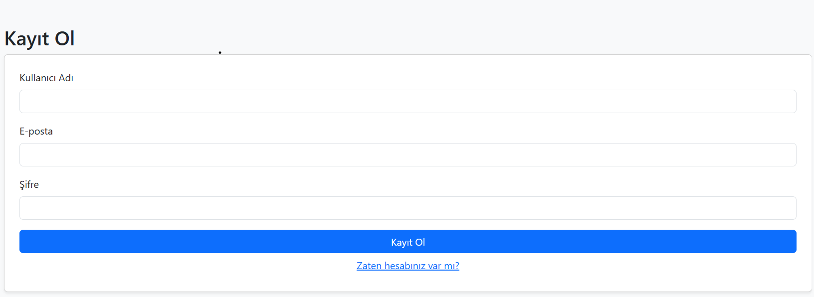
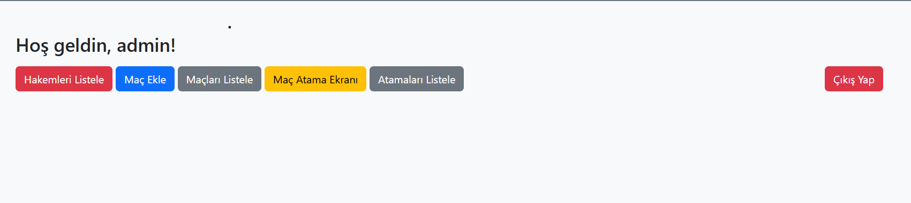
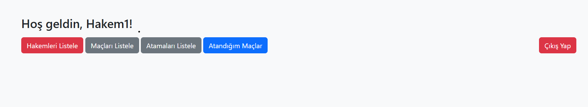
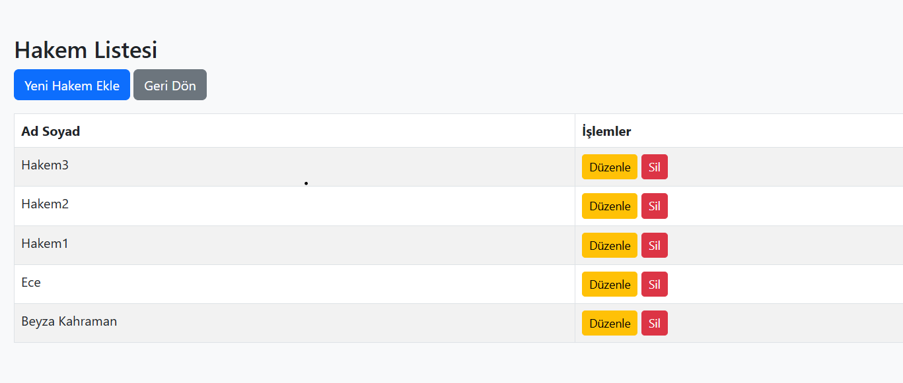
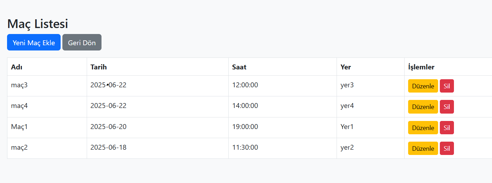
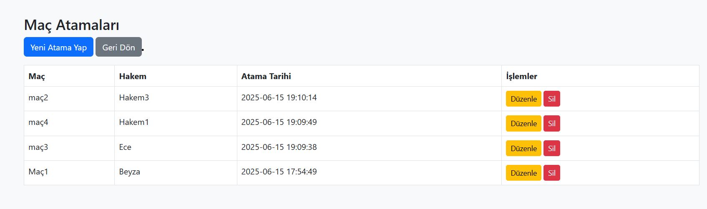
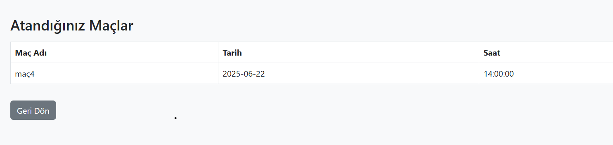

# ⚽ Hakem Maç Atama Sistemi

Bu proje, belirli bir admin tarafından futbol maçlarına hakem atamalarının yapılabildiği, sisteme kayıtlı hakemlerin ise kendilerine atanmış maçları görebildiği, kullanıcı kayıt ve giriş işlemlerinin yönetildiği basit bir web tabanlı uygulamadır. Uygulama PHP (Vanilla), MySQL ve Bootstrap kullanılarak geliştirilmiştir.

## 🔧 Kullanılan Teknolojiler

- PHP (Vanilla)
- MySQL 
- HTML5, CSS
- Bootstrap 5

## 📋 Özellikler

### 👥 Kullanıcı Sistemi
- Kullanıcılar kayıt olabilir, giriş yapabilir.
- Her kullanıcı `users` tablosuna kayıt edilir.
- Hakemler ayrıca `referees` tablosunda tutulur.
- `admin` rolündeki kullanıcılar tüm atama işlemlerini yapabilir.

### 🏟️ Maç Yönetimi
- Admin yeni maç ekleyebilir.
- Tüm kullanıcılar maçları listeleyebilir.
- Admin, maç listesinde güncelleme veya silme işlemi yapabilir.

### ⚖️ Hakem Atamaları
- Admin, sistemde kayıtlı hakemleri maçlara atayabilir.
- Atamalar `assignments` tablosunda tutulur.
- Admin, yapılan atamaları görüntüleyebilir, güncelleyebilir veya silebilir.
- Hakem kullanıcılar, tüm maçları veya sadece kendilerine atanmış maçları görüntüleyebilir.

### 🧑‍⚖️ Rol Sistemi
- `users` tablosunda her kullanıcının bir `role` bilgisi (`admin` veya `referee`) vardır.
- Sadece admin yetkisine sahip kullanıcılar:
  - Maç ekleyebilir.
  - Atama yapabilir.
  - Atama silebilir veya güncelleyebilir.

## 🗂️ Veritabanı Yapısı

### `users`  
| Alan         | Tür          | Açıklama                     |
|--------------|--------------|------------------------------|
| id           | INT (PK)     | Otomatik arttırılan ID       |
| username     | VARCHAR      | Kullanıcı adı                |
| email        | VARCHAR      | Kullanıcı e-posta            |
| password     | VARCHAR      | Hashlenmiş şifre             |
| role         | ENUM         | `admin` veya `referee`       |

### `referees`  
| Alan         | Tür          | Açıklama                     |
|--------------|--------------|------------------------------|
| user_id      | INT (PK/FK)  | `users.id` ile ilişkilidir   |
| name         | VARCHAR      | Hakemin adı-soyadı           |

### `matches`  
| Alan         | Tür          | Açıklama                     |
|--------------|--------------|------------------------------|
| id           | INT (PK)     | Maç ID                       |
| match_name   | VARCHAR      | Maçın adı                    |
| match_date   | DATE         | Maç tarihi                   |
| match_time   | TIME         | Maç saati                    |
| location     | VARCHAR      | Maçın oynanacağı yer         |

### `assignments`  
| Alan         | Tür          | Açıklama                     |
|--------------|--------------|------------------------------|
| id           | INT (PK)     | Atama ID                     |
| match_id     | INT (FK)     | `matches.id` ile ilişkili    |
| referee_id   | INT (FK)     | `users.id` ile ilişkili      |
| assigned_at  | TIMESTAMP    | Atama yapılma zamanı         |

## 📷 Ekran Görüntüleri

- Kayıt ol ekranı  


- Admin ekranı  
  

- Kullanıcı(hakem) ekranı  
  

- Var olan hakemlerin listesi
  

- Tüm maçların listelendiği ekran  


- Admin tarafından atanmış maçların listelendiği ekran  
  

- Kullanıcının yalnızca kendisine atanmış maçların listesini gördüğü ekran
  


## 🚀 Kurulum

1. **Gerekli Programları Kurun**
    - XAMPP (PHP + MySQL barındırır) → PHP ve MySQL çalıştırmak için

2. **Proje dosyalarını yerleştirin**
   - Bu proje dosyalarını .zip olarak indirin veya GitHub’dan klonlayın.
   - hakem-sistemi adında bir klasöre çıkarın.
   - Bu klasörü XAMPP kurulumundaki htdocs klasörünün içine atın. Örnek yol: C:\xampp\htdocs\hakem-sistemi

3. **XAMPP'ı başlatın**
    - XAMPP Control Panel’i açın.
    - Apache ve MySQL servislerini başlatın.

4. **Veritabanını oluşturun**
    - Tarayıcıda http://localhost/phpmyadmin adresine gidin.
    - Sol menüden Yeni'ye tıklayın ve şu ismi verin: hakem_takip
    - Ardından aşağıdaki SQL komutlarını çalıştırarak tabloları oluşturun.  

``` sql 
CREATE TABLE users (
  id INT AUTO_INCREMENT PRIMARY KEY,
  username VARCHAR(100),
  email VARCHAR(100) UNIQUE,
  password VARCHAR(255),
  role ENUM('admin', 'referee') DEFAULT 'referee'
);

CREATE TABLE referees (
  user_id INT PRIMARY KEY,
  name VARCHAR(100),
  FOREIGN KEY (user_id) REFERENCES users(id) ON DELETE CASCADE
);

CREATE TABLE matches (
  id INT AUTO_INCREMENT PRIMARY KEY,
  match_name VARCHAR(255),
  match_date DATE,
  match_time TIME,
  location VARCHAR(255)
);

CREATE TABLE assignments (
  id INT AUTO_INCREMENT PRIMARY KEY,
  match_id INT,
  referee_id INT,
  assigned_at TIMESTAMP DEFAULT CURRENT_TIMESTAMP,
  FOREIGN KEY (match_id) REFERENCES matches(id) ON DELETE CASCADE,
  FOREIGN KEY (referee_id) REFERENCES users(id) ON DELETE CASCADE
); 
```

5. **Uygulamayı başlatın**
   - Tarayıcıya `http://localhost/hakem_takip/register.php` yazarak kayıt ol ekranına gidebilirsiniz.


